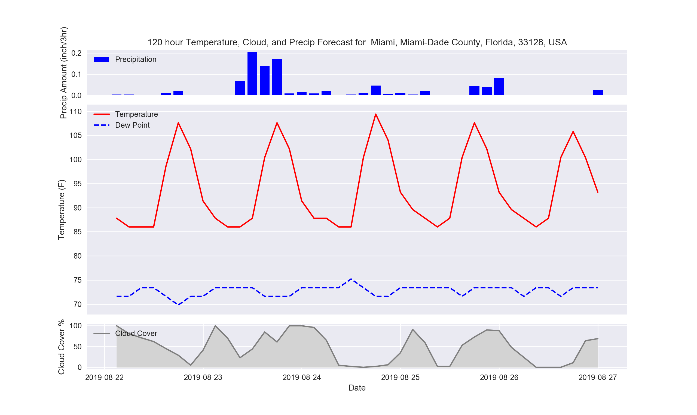
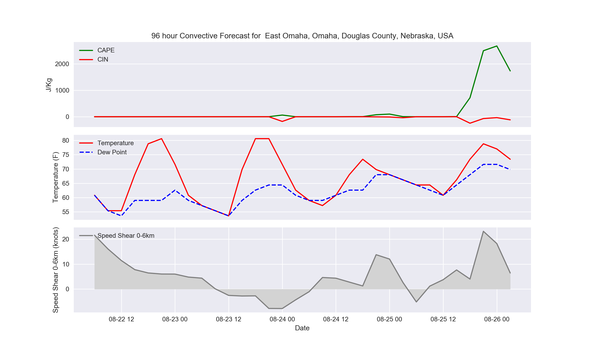

# Weather Forecaster
Weather Modeler was developed by me with the objective of creating personalized dashboards for meteorological forecasters. This program downloads GFS and HRRR model data from a Unidata UCAR TDS Server, stores the data in local variables, processes and visualizes it in the form of a graph. The program will display regular weather parameters or convective parameters depending on the graph of choice.

When this program is initially run, it will as for a geographic point location, and you may enter geographic coordinates or a city/town followed by the state. Since this is a global model, it accounts for the entire Northern Hemisphere. Once the location is succesfully entered, it will prompt you to enter the length of the forecast in hours. The GFS forecasts out to a maximum of 16 days, which means if you enter any numbers higher than 384 hours it will default to 384. Here is an example of the temperature, dewpoint, precip, and cloud cover diagram. 

# Required Python Packages

Here is an example of the convective weather graph.

This program is intended to improve location forecasting and benefit meteorologists by providing them with quanitifiable data rather than interpolating large scale maps. If you have any questions regarding this program don't hesitate to reach out. 
